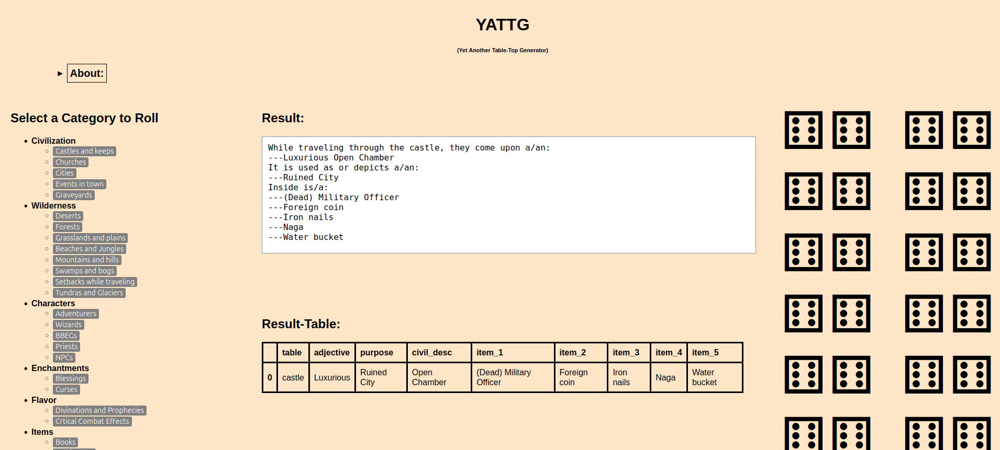

# Y.A.T.T.G. (Yet Another Table-Top Generator)
View the website live at: 
www.yattg.com
  

Y.A.T.T.G. (Yet Another Table Top generator) created by Mark Z is a DnD 5e based random generator with the goal of creating a generator that is more random than in the DM Guide and AIs like ChatGPT. 
I found many generators or similar websites to this one were not random enough. So I decided that my goal would be to make every table have a minimum of 500 possible rolls, with results that make sense 
for a fantasy realm setting. Each table was created and hand-picked with the ultimate goal of rolling several tables together to create a solid improv prompt for a DM on the fly. With that in mind, 
Some tables are not quite there yet, but several have over 2000 possible combinations! I hope you enjoy my 5 years of effort and that they bring joy to your own TTRPGs like it does for mine!

Home screen: 

  
